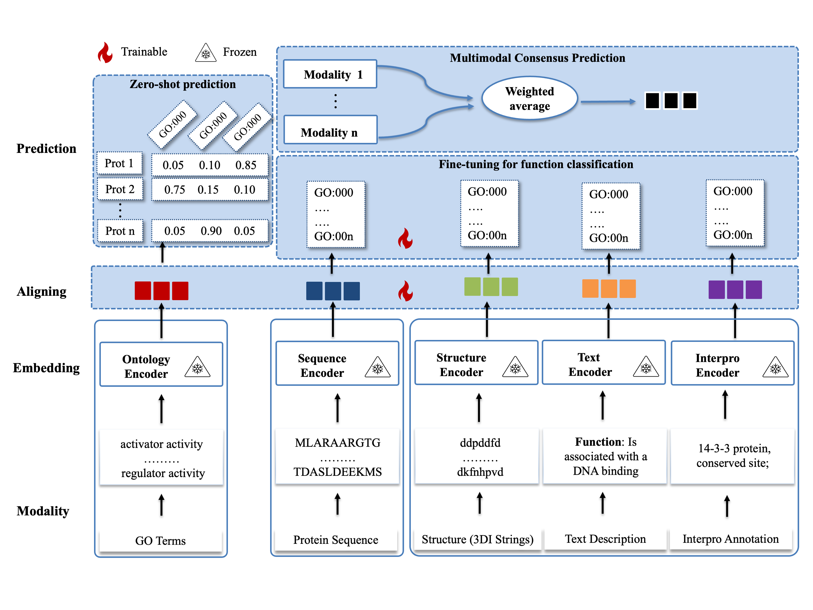

# FunBind: A multimodal foundational AI model for improving protein function prediction
[](https://github.com/jianlin-cheng/FunBind/blob/main/model.png)


`FunBind` is a multimodal model for protein function prediction, combining protein sequences, structures, textual descriptions, domain annotations, and ontology information.
It supports both direct `classification` and `zero-shot` prediction of novel functional terms through cross-modal contrastive learning.




## Contents

- [Installation](#installation)
- [Dataset](#dataset)
- [Inference](#inference)
    - [Zero-shot Inference](#zero-shot-inference)
    - [Classification](#function-classification)
- [Training](#training)
    - [Self-supervised Pretraining](#self-supervised-pretraining)
    - [Supervised Function Classification via Fine-Tuning](#supervised-function-classification-via-fine-tuning)
- [License](#license)
- [Citing this work](#reference)


## Installation
#### To get started with FunBind, follow these steps:

<details>

1. Clone the Repository
```
git clone https://github.com/jianlin-cheng/FunBind.git
cd FunBind
```

2. Download checkpoints (~ GB total):
```
wget url-for-data
unzip downloaded-data
```

3. Set Up the Conda Environment:
```bash
conda env create -f FunBind.yml
conda activate FunBind
```
</details>


## Dataset 

<details>

Sample Sequence Data:
```

```

Sample Structure Data:
```

```

Sample Text Data:
```

```

Sample Interpro Data:
```

```

Sample Ontology Data:
```

```

</details>

## Inference
<details>


### Zero-shot Inference

Feature Extraction and Comparison Across Multiple Modalities (e.g., Sequence, Structure, Text, and Domain Annotations)

```bash
 python zeroshot_inference.py --model_checkpoint /path/to/funbind_checkpoint.pth --input-path input-file  --modality ... --ontology-path examples/ontology.txt --go-graph examples/go-basic.obo --device cuda:1
```

Example, if you want to use Text to perform zero-shot on the sample data provided in examples, run 

```bash
python zeroshot_inference.py --model_checkpoint /path/to/funbind_checkpoint.pth --input-path examples/text.txt  --modality Text --ontology-path examples/ontology.txt --go-graph examples/go-basic.obo --device cuda:1
```


This will give you the output
```python
Predictions for protein: Q64565
Top 1 term: ('GO:0170035',), Score: 85.83%
Top 2 term: ('GO:0170033',), Score: 13.29%
Top 3 term: ('GO:1902674',), Score: 0.34%
-----------------------------
Predictions for protein: A8BPK8
Top 1 term: ('GO:1905504',), Score: 87.74%
Top 2 term: ('GO:0097561',), Score: 5.90%
Top 3 term: ('GO:0097560',), Score: 5.66%
-----------------------------
Predictions for protein: Q12198
Top 1 term: ('GO:0170043',), Score: 63.78%
Top 2 term: ('GO:0170033',), Score: 20.56%
Top 3 term: ('GO:0170041',), Score: 9.86%
-----------------------------
Predictions for protein: P18335
Top 1 term: ('GO:0170038',), Score: 95.72%
Top 2 term: ('GO:0170035',), Score: 3.15%
Top 3 term: ('GO:0170039',), Score: 1.13%
-----------------------------

```


### Function Classification

```bash
python train.py --epochs [Number_epoch] --folder [intermediate_folder]
```

</details>

## Training
<details>

### Self-supervised Pretraining

### Supervised Function Classification via Fine-Tuning

</details>

## Developer

<details>

```
Frimpong Boadu
Deparment of Computer Science
University of Missouri
Columbia, MO 65211, USA
Email: fbqc9@missouri.edu
```
</details>


## Contact
<details>

```
Jianlin (Jack) Cheng, PhD, AAAS Fellow
Curators' Distinguished Professor
William and Nancy Thompson Distinguished Professor
Department of Electrical Engineering and Computer Science
University of Missouri
Columbia, MO 65211, USA
Email: chengji@missouri.edu
```

</details>

## License
This project is covered under the MIT License

## Reference
<details>
FunBind: A multimodal foundational AI model for improving protein function prediction.
</details>